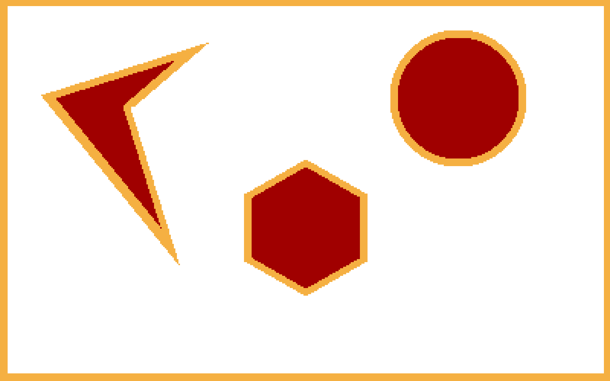
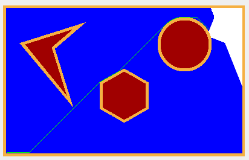

# Dijkstra-Shortest-Path
Navigation of a point robot from start to goal point using Dijkstra's algorithm in a known environment with defined clearance to avoid collisions

## Dependencies

 -  Python
-   Opencv 3.4.5
-   Numpy
-   queue

## Steps to run the package
1.Clone the project 

    git clone https://github.com/aditiramadwar/Dijkstra-Shortest-Path.git

2.Open terminal inside the package folder and run the following

    python3 Dijkstra-pathplanning-Aditi-Ramadwar.py

## Results
### Video link of exploration is found [here](https://drive.google.com/file/d/105A0ppi7QHxXfyw00jZwAXdum1rCDvay/view?usp=sharing)
### Grid Visualization
The red area is the obstacle space and the orange part is the clearance area.
 

### Exploration
Start point = (0, 0)
Goal point = (340, 210)
 

### Path Search
The green line across the grid is the representation of the shortest path that can be taken to reach the goal point from the start point
 

